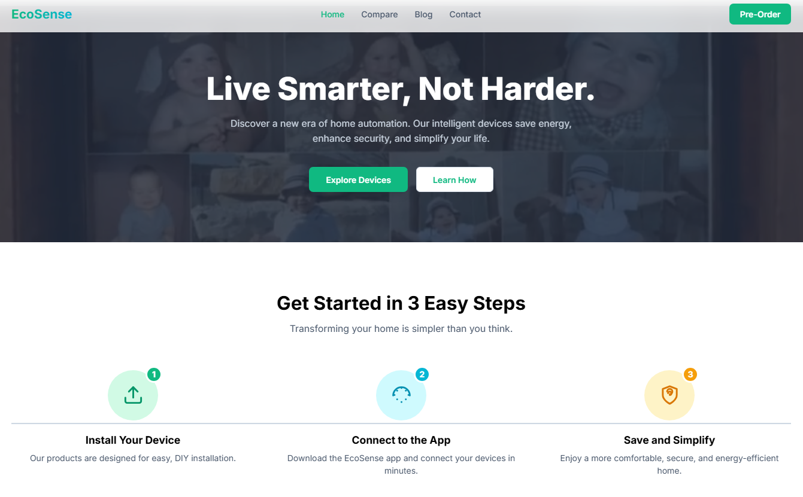

# EcoSense - Smart Home Solutions Marketing Website

## 🚀 Live Demo

## 📋 Project Description

This is a responsive, single-page marketing website for **EcoSense**, a smart home technology company. The site is designed to be modern, engaging, and interactive, showcasing the company's flagship products and encouraging user pre-orders. A key feature is the integration of the Google Gemini API to provide AI-powered, dynamic content such as personalized setup advice, blog post ideas, and message drafting.

## ✨ Key Features

- **Single-Page Application (SPA) feel:** Smooth navigation between different sections (Home, Compare, Blog, Contact) without page reloads.
- **Dynamic Content:** Content for different pages like product details and blog posts is rendered dynamically using JavaScript.
- **AI-Powered Features:**
  - **Personalized Setup Helper:** Users can describe their home, and the Gemini API provides custom installation tips.
  - **Blog Idea Generator:** Generates creative blog post ideas directly from the Gemini API.
  - **AI Message Drafting:** Assists users in drafting contact messages based on their goals.
- **Interactive UI Elements:** Includes an energy savings calculator, product comparison tool, and smooth scroll-on-fade animations.
- **Responsive Design:** Fully functional and looks great on devices of all sizes, from mobile phones to desktops.

## 🛠️ Tech Stack

- **Frontend:** HTML5, CSS3, JavaScript (ES6+)
- **Styling:** Tailwind CSS (via CDN)
- **Fonts:** Google Fonts (Inter)
- **AI Integration:** Google Gemini API
